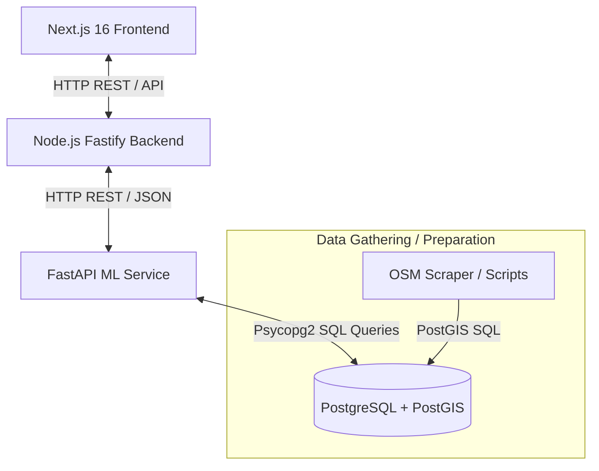

# MapMyStore — Project Submission Viva Preparation Guide

This guide is prepared to help you ace your final year project viva. It details the system architecture, technology stack selection, and why these technologies were chosen over alternatives.

---

## 🗺️ 1. Project Overview & Pitch
**MapMyStore** is a location intelligence and spatial analytics platform designed to help entrepreneurs and business owners identify the optimal locations to open new retail or food outlets. It translates complex spatial data (footfall generators, competitor density, transit accessibility, local demographics, and average income) into actionable recommendations using machine learning.

---

## 🏗️ 2. System Architecture & Data Flow

The project is structured as a **Decoupled Microservice Architecture** to separate user interaction, business logic, and heavy machine learning compute:

### Complete End-to-End Data Flow:
1. **User Action (Frontend)**: The user interacts with the **Leaflet Map**, selects a business category (Retail or Food), and clicks a location or enters coordinates.
2. **API Request (Backend)**: The frontend sends a POST request with coordinates `(latitude, longitude)` and category to the **Node.js Fastify** backend `/api/predict`.
3. **ML Service Handshake**: The Node.js backend acts as an API gateway and proxies the request to the **FastAPI ML Service** running on Port 8001.
4. **Spatial Feature Lookup**:
   - The FastAPI service queries the **PostgreSQL (PostGIS)** database.
   - It performs an `ST_Contains` spatial query to check which grid cell contains the coordinates.
   - It pulls pre-calculated spatial features for that grid cell (e.g., population, distance to nearest transit stop, competitor count, rent per sqft).
5. **Prediction Engine**:
   - The FastAPI service merges DB features with any user overrides.
   - It passes the final feature vector into the category-specific **XGBoost Classifier** (`.pkl` file loaded via `joblib`).
   - The model outputs the **Success Probability** and **Feature Importance** (which factors contributed most to the prediction).
6. **Response Enhancement**: FastAPI returns the raw prediction object to Fastify. Fastify formats and enhances this data (converting probabilities to percentages, mapping classes to stars, calculating risk levels) and sends the clean payload to the Next.js frontend.
7. **Visualization**: The frontend renders the success percentage, displays a star rating, plots feature importances in **Recharts**, and visualizes regional success gradients on the Leaflet map.

---

## 💻 3. Technology Stack: Choices vs. Alternatives

Here is the justification for every technology in MapMyStore, formatted exactly as examiners expect:

### A. Frontend: Next.js (React 19 + TypeScript + Leaflet + Recharts)
* **Next.js & React 19**:
  * *Why*: Next.js offers Server-Side Rendering (SSR) and Server Actions out of the box, ensuring faster page loading and better SEO optimization. TypeScript ensures type-safety, preventing runtime errors in complex spatial coordinate data types.
  * *Alternative (Vite + React)*: Vite only generates Single Page Applications (SPAs) where rendering happens entirely client-side. This results in slower first-contentful-paint (FCP) and lacks built-in SEO capabilities.
* **Leaflet.js**:
  * *Why*: Leaflet is an open-source, lightweight, mobile-friendly mapping library. Combined with OpenStreetMap tiles, it is completely free and has a robust plugin ecosystem (like `leaflet.heat` for heatmaps).
  * *Alternative (Google Maps API)*: Google Maps API is expensive, requires a credit card, and operates on a strict pay-as-you-go billing model. Leaflet yields identical spatial visualization capabilities at zero cost.
* **Recharts**:
  * *Why*: Recharts is written specifically for React applications, featuring clean declarative components that bind perfectly to React state and render fluidly.
  * *Alternative (D3.js)*: D3 has a massive learning curve and directly manipulates the DOM, which conflicts with React's Virtual DOM reconciliation engine.

### B. Backend: Node.js (Fastify)
* **Fastify**:
  * *Why*: Fastify is a modern web framework that is up to **2-3x faster than Express**. It has built-in JSON Schema compilation/validation (speeding up API serialization) and native support for async/await controllers.
  * *Alternative (Express.js)*: Express is old, single-threaded synchronous by design (requiring manual wrapper code for async/await), and has significant routing overhead compared to Fastify.
* **Uber H3 spatial index (`h3-js`)**:
  * *Why*: Uber's H3 represents the world as a hexagonal grid. Hexagons have the unique property where the distance from a cell's center to all 6 of its neighbors is identical. This simplifies radius search, clustering, and geographic smoothing algorithms.
  * *Alternative (Square Grids / Geohashes)*: Square grids suffer from the "diagonal distortion" (corners are further than edge neighbors). Geohashes (quadkeys) vary in actual physical dimensions depending on the latitude (narrower at the poles).

### C. ML Service: FastAPI + Python (XGBoost + Scikit-Learn)
* **FastAPI**:
  * *Why*: FastAPI is built on ASGI (Asynchronous Server Gateway Interface), making it extremely fast (comparable to Go/Node.js). It uses **Pydantic** for automated request validation and automatically generates interactive API documentation `/docs` (Swagger UI).
  * *Alternative (Flask)*: Flask is WSGI-based (synchronous), meaning concurrent incoming predictions block the main thread unless wrapped in complex thread pools.
* **XGBoost (Extreme Gradient Boosting)**:
  * *Why*: XGBoost is a tree-based ensemble method. It is highly optimized, handles non-linear interactions, is robust to missing values, and does not require extensive feature scaling. Crucially, it provides **Feature Importance** metrics (interpretable AI), telling the user *why* a location is recommended.
  * *Alternative (Deep Learning / Neural Networks)*: Neural Networks are a black-box (hard to explain feature importance), require enormous training data, take a long time to train, and need resource-intensive GPUs. XGBoost achieves superior accuracy on tabular spatial data with lightweight CPU inference.
  * *Alternative (Linear / Logistic Regression)*: Too simple. Cannot capture complex non-linear combinations (e.g., high footfall is good, but if competitor count is over 10, the opportunity declines sharply).

### D. Database: PostgreSQL + PostGIS
* **PostGIS**:
  * *Why*: PostGIS turns PostgreSQL into a spatial database. It supports real spatial geometries (Points, Polygons), spatial indices (R-Tree / GiST), and advanced spatial functions (`ST_Contains`, `ST_Distance`, `ST_Buffer`) to perform calculations directly in SQL at millisecond speeds.
  * *Alternative (MongoDB / NoSQL)*: MongoDB's geospatial queries are basic (limited to simple 2dsphere indexing). It lacks complex coordinate transformations, spatial joins, and standard GIS operations.

---

## 🎯 4. Expected Viva Questions & Best Answers

1. **Q: Why did you split the backend into Node.js and Python? Why not write everything in Python?**
   * *A*: "Separation of concerns. Node.js is excellent for handling asynchronous I/O, user authentication, sessions, and serves as an efficient API gateway. Python is the industry standard for machine learning, containing highly optimized libraries like XGBoost, Pandas, and Scikit-learn. Splitting them keeps our system decoupled, meaning we can scale the ML service independently of our web server."

2. **Q: What is PostGIS and why did you use it?**
   * *A*: "PostGIS is a spatial extension for PostgreSQL. Standard databases only understand numbers and text, but PostGIS introduces spatial datatypes (like geometry/geography) and indices (like GIST). This lets us query things like 'which grid cell contains this coordinate?' using `ST_Contains` in milliseconds, instead of calculating distances in code."

3. **Q: How does your model explain its decisions?**
   * *A*: "We use XGBoost's built-in feature importance. It calculates the 'gain' or 'weight' of each spatial attribute (e.g., demographic density, transit accessibility) during tree splits. We expose this via our `/feature-importance` API endpoint, which is displayed as a bar chart on the frontend so business owners can see exactly which factors are driving the recommendation."

4. **Q: How did you handle data collection and scraping?**
   * *A*: "We built data scrapers (found in `/Scraper` and `/scripts`) that fetch Points of Interest (POIs), road density, and transit details from OpenStreetMap using the Overpass API. We cleaned ward demographics and commercial rental data using Python script pipelines and loaded them into PostGIS tables mapped to our grid cells."
